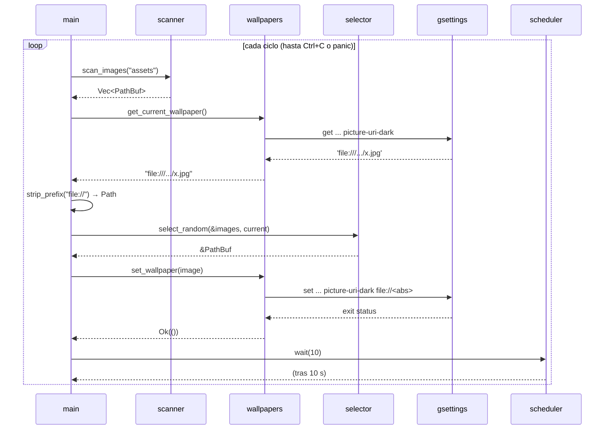

# Arquitectura — wallpaper-daemon-rs

Este documento describe la arquitectura **actual (v0.1.0, en desarrollo)** y la **arquitectura objetivo** hacia la que evoluciona el proyecto.

> Última actualización: 2026-09-24 · commit `3e4b5d6`.

---

## 1. Visión general

Un binario Rust de un solo crate que orquesta cinco responsabilidades:

1. **Descubrir** imágenes en disco (`scanner`).
2. **Elegir** una de ellas (`selector`).
3. **Consultar y aplicar** el fondo en el escritorio (`wallpapers`).
4. **Esperar** entre ciclos (`scheduler`).
5. **Coordinar** el flujo en un bucle infinito (`main`).

No existe todavía capa de configuración (`config.rs` está vacío y sin declarar en `main.rs`). El scheduler es mínimo: una espera bloqueante con `thread::sleep` y un intervalo fijo de 10 s escrito en `main`.

```text
                    ┌──────────────┐
                    │   main.rs    │  orquestación
                    └──────┬───────┘
      ┌─────────────┬────┴────────┬─────────────────┐
      ▼             ▼             ▼                 ▼
┌───────────┐ ┌───────────┐ ┌───────────────┐ ┌───────────┐
│  scanner  │ │ selector  │ │  wallpapers   │ │ scheduler │
│ (fs)      │ │ (rand)    │ │ (process)     │ │ (sleep)   │
└─────┬─────┘ └───────────┘ └───────┬───────┘ └───────────┘
      ▼                             ▼
 Sistema de                gsettings (proceso hijo)
 archivos                           ▼
                             GSettings / dconf
                                    ▼
                                  GNOME
```

## 2. Estructura del código

```text
src/
├── main.rs                        # entrada; declara mod scanner, selector, wallpapers, scheduler
├── scanner.rs                     # scan_images
├── selector.rs                    # select_random
├── wallpapers.rs                  # get_current_wallpaper, set_wallpaper
├── scheduler.rs                   # wait
├── config.rs                      # (vacío, sin declarar en main.rs)
└── code_templates/                # referencia; fuera del árbol de módulos
    ├── review.rs
    └── wallpapers_review.rs
tests/
├── scanner_test.rs                # (vacío)
└── wallpaper_test.rs              # (vacío)
```

> `code_templates/` no está referenciado con `mod`, por lo que **el compilador no lo ve**. Contiene versiones anteriores/comentadas de `wallpapers.rs` para estudio (p. ej. lee y escribe `picture-uri` en lugar de `picture-uri-dark`).

## 3. Módulos

### 3.1 `main.rs`

Punto de entrada. No contiene lógica de dominio; ejecuta en un `loop` infinito el siguiente ciclo:

```rust
loop {
    let images       = scanner::scan_images("assets")?;
    let current      = wallpapers::get_current_wallpaper()?;
    let current_path = current.strip_prefix("file://").map(Path::new);
    let image        = selector::select_random(&images, current_path)?;
    wallpapers::set_wallpaper(image)?;
    scheduler::wait(10);
}
```

Notas:

- En la implementación real cada `?` es un `.expect(...)`, es decir, cualquier error termina en *panic* y **detiene el bucle**.
- La carpeta se escanea en **cada iteración**, de modo que las imágenes nuevas se detectan sin reiniciar.
- Imprime `Changing wallpaper...`, `Current wallpaper: ...` y `Selected wallpaper: ...` en cada ciclo.
- No hay condición de salida ni manejo de señales: el proceso termina con `Ctrl+C` (SIGINT) o por un panic.

### 3.2 `scanner.rs`

```rust
pub fn scan_images(directory: &str) -> Result<Vec<PathBuf>, Box<dyn std::error::Error>>
```

| Aspecto | Comportamiento |
|---|---|
| Recorrido | `fs::read_dir`, **no recursivo** |
| Filtro | Solo archivos (`is_file`) con extensión `jpg`, `jpeg`, `png` o `webp` (minúsculas tras `to_lowercase`) |
| Retorno | `Vec<PathBuf>` con rutas **tal como las entrega `read_dir`**: relativas si `directory` es relativo |
| Orden | No garantizado (depende del sistema de archivos) |
| Errores | Propaga fallos de E/S (directorio inexistente, permisos) |

### 3.3 `selector.rs`

```rust
pub fn select_random<'a>(
    images: &'a [PathBuf],
    current: Option<&Path>,
) -> Option<&'a PathBuf>
```

- Filtra las imágenes distintas de `current` (si `current` es `None`, no excluye nada).
- Devuelve `None` si no queda ninguna candidata.
- Elige un índice con `rand::rng().random_range(0..len)` (`rand` 0.10, trait `RngExt`).
- Devuelve una **referencia** al elemento original: el lifetime `'a` liga el resultado a `images`, así que no se clonan rutas.

### 3.4 `wallpapers.rs`

Capa de acceso a GNOME mediante procesos hijo (`std::process::Command`).

```rust
pub fn get_current_wallpaper() -> Result<String, Box<dyn std::error::Error>>
pub fn set_wallpaper(image: &Path) -> Result<(), Box<dyn std::error::Error>>
```

| Función | Comando ejecutado | Notas |
|---|---|---|
| `get_current_wallpaper` | `gsettings get org.gnome.desktop.background picture-uri-dark` | Convierte stdout a `String`, recorta espacios y comillas simples. No revisa `output.status`. |
| `set_wallpaper` | `gsettings set org.gnome.desktop.background picture-uri-dark file://<ruta canónica>` | Usa `canonicalize()` para obtener ruta absoluta; devuelve error si `gsettings` sale con código distinto de 0. |

### 3.5 `scheduler.rs`

```rust
pub fn wait(seconds: u64)
```

Bloquea el hilo actual con `thread::sleep(Duration::from_secs(seconds))`. Es la versión mínima prevista para la fase 5: no es cancelable, no gestiona señales y no conoce ninguna configuración; el valor (`10`) lo decide quien la llama (`main`).

## 4. Flujo de ejecución



## 5. Datos y tipos

| Dato | Tipo | Propietario |
|---|---|---|
| Lista de imágenes | `Vec<PathBuf>` | `main` (la crea `scanner`) |
| Fondo actual | `String` → `Option<&Path>` | `main` (préstamo derivado del `String`) |
| Imagen elegida | `&PathBuf` | Préstamo de `images` |
| URI enviada a GNOME | `String` (`file://…`) | Local a `set_wallpaper` |

Relación de ownership:

```text
main
 ├── images : Vec<PathBuf>            (dueño)
 │       └── &PathBuf ──► image       (préstamo devuelto por selector)
 └── current : String                 (dueño)
         └── &Path ──► current_path   (préstamo pasado al selector)
```

## 6. Interfaces externas

| Interfaz | Uso |
|---|---|
| CLI `gsettings` | Lectura y escritura de `org.gnome.desktop.background` |
| Clave `picture-uri-dark` | Fondo para tema oscuro (se **lee y escribe**) |
| Clave `picture-uri` | Fondo para tema claro (**no se usa** actualmente) |
| Sistema de archivos | Lectura de `assets/` (ruta fija relativa al directorio de ejecución) |

## 7. Manejo de errores

- Todas las funciones públicas devuelven `Result<_, Box<dyn std::error::Error>>` (o `Option` en el selector).
- `?` propaga errores de E/S, conversión UTF-8 y `canonicalize`.
- `main` convierte cualquier error en *panic* con `expect`. Al estar dentro de un bucle infinito, un fallo puntual (p. ej. `gsettings` no disponible un instante o una carpeta sin alternativas) **termina todo el programa** en lugar de saltar al siguiente ciclo.

**Objetivo:** un enum `WallpaperError` que implemente `Display` + `Error` (variantes como `Io`, `Gsettings`, `NoImages`, `Utf8`) y un `main` que devuelva `Result` e imprima un mensaje claro con código de salida distinto de 0.

## 8. Decisiones de diseño

| # | Decisión | Motivo |
|---|---|---|
| D1 | Usar `gsettings` vía `Command` en lugar de D-Bus | Menor complejidad inicial; permite aprender procesos hijo antes que IPC |
| D2 | Solo `std` + `rand` | Entender qué resuelve cada dependencia antes de añadirla |
| D3 | `select_random` devuelve `Option<&PathBuf>` | Evita clonar y muestra lifetimes; `None` expresa "sin alternativas" |
| D4 | `Box<dyn Error>` como error temporal | Simplicidad mientras el dominio de errores no está definido |
| D5 | `code_templates/` fuera de `mod` | Conservar experimentos sin afectar la compilación |
| D6 | Módulo por responsabilidad | Facilita tests y la sustitución futura del backend |
| D7 | Scheduler como `thread::sleep` bloqueante dentro de un `loop` | Primer paso hacia el daemon sin añadir concurrencia, canales ni señales todavía |
| D8 | Escanear la carpeta en cada ciclo | Detecta imágenes nuevas sin reiniciar; el coste es despreciable para carpetas pequeñas |

## 9. Limitaciones que afectan a la arquitectura

1. **Comparación relativa vs. absoluta.** `scanner` devuelve `assets/x.jpeg` y `main` compara contra una ruta absoluta extraída de la URI, por lo que la exclusión del fondo actual puede fallar. Corregir en el scanner (rutas canónicas) o en el selector (comparar canonicalizadas).
2. **Solo tema oscuro.** `get` y `set` usan ya la misma clave (`picture-uri-dark`, corregido en `b8736bd`), pero `picture-uri` (tema claro) no se toca: con el tema claro el cambio no sería visible. Falta decidir la estrategia (escribir ambas claves o detectar `color-scheme`).
3. **Acoplamiento de `main` a GNOME:** el parseo de `file://` vive en `main`; debería pertenecer a `wallpapers` (o al backend) y decodificar URIs.
4. **Sin inyección de dependencias:** `main` llama directamente a funciones libres, lo que dificulta testear sin GNOME.
5. **Scheduler bloqueante y con intervalo fijo:** `wait` no se puede interrumpir ni reconfigurar, lo que impide implementar `stop`/`next` sin rediseñarlo (canales, `Condvar` o manejo de señales).
6. **Sin condición de salida limpia:** el `loop` de `main` solo termina por `Ctrl+C` o por un panic.

## 10. Arquitectura objetivo

```text
                       ┌─────────────────────┐
                       │      CLI / IPC      │  start · stop · next · status
                       └──────────┬──────────┘
                                  ▼
                       ┌─────────────────────┐
                       │  WallpaperManager   │
                       │  ─ wallpapers       │
                       │  ─ config           │
                       └───┬──────┬───────┬──┘
                           │      │       │
              ┌────────────┘      │       └──────────────┐
              ▼                   ▼                      ▼
       ┌─────────────┐    ┌─────────────┐      ┌──────────────────┐
       │   Scanner   │    │  Scheduler  │      │  trait Backend   │
       │ (recursivo) │    │ (intervalo) │      │  get / set       │
       └─────────────┘    └─────────────┘      └───┬──────────┬───┘
                                                    ▼          ▼
                                             GsettingsBackend  DbusBackend
                                                               (futuro)
```

Piezas previstas:

| Componente | Descripción | Fase |
|---|---|---|
| `config.rs` | Carga/guarda configuración (directorio, intervalo) en `~/.config/...` con `serde` + `toml` | 5 |
| `scheduler.rs` | **Hecho (mínimo):** `wait` con `thread::sleep`. Pendiente: intervalo configurable, canales/señales | 5–6 |
| `Wallpaper` / `WallpaperManager` | Modelado del dominio con `struct` + `impl` | 5 |
| `trait Backend` | Abstrae `get_current`/`set`; primera implementación `GsettingsBackend` | 4–5 |
| Daemon + control | Comandos `start/stop/next/status`, señales (`SIGTERM`) | 6 |
| `DbusBackend` | Sustituye `gsettings` por D-Bus (p. ej. crate `zbus`) | 7 |
| Multi-monitor | Estado y fondo por salida (`eDP-1`, `HDMI-1`, …) | 8 |
| `history` | Historial persistente de las últimas N imágenes usadas | 5+ |

## 11. Estrategia de pruebas

| Nivel | Objetivo | Estado |
|---|---|---|
| Unitarios en `scanner` | Filtrado por extensión (mayúsculas/minúsculas), directorio vacío, directorio inexistente. Usar `std::env::temp_dir()` | ⬜ (`tests/scanner_test.rs` vacío) |
| Unitarios en `scheduler` | Difícil de probar con `sleep` real; considerar inyectar la espera o usar intervalos de 0 s | ⬜ |
| Unitarios en `selector` | Excluye la actual, devuelve `None` sin candidatas, lista vacía | ⬜ |
| Integración de `wallpapers` | Requiere sesión GNOME; aislar con el `trait Backend` y un *mock* | ⬜ (`tests/wallpaper_test.rs` vacío) |

Comandos: `cargo test`, `cargo clippy`, `cargo fmt --check`.

## 12. Extensión: cómo añadir un backend nuevo (plan)

1. Definir `trait Backend { fn current(&self) -> Result<PathBuf, Error>; fn set(&self, image: &Path) -> Result<(), Error>; }`.
2. Mover el código actual de `wallpapers.rs` a `GsettingsBackend`.
3. Crear la nueva implementación (p. ej. `DbusBackend`).
4. Inyectar el backend en `WallpaperManager` según configuración.